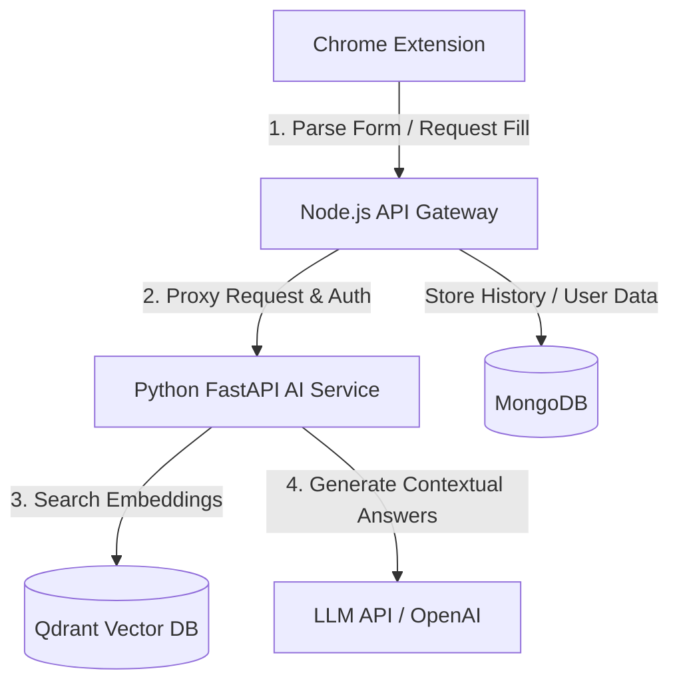

# Job Autofill Assistant

An AI-powered Chrome extension and self-hosted RAG (Retrieval-Augmented Generation) backend ecosystem that automatically analyzes job application forms, retrieves contextually relevant information from your resume, and autofills fields with precision.

## Architecture Overview



### Components

1. **Extension (`/extension`)**: A Manifest V3 Chrome Extension.
   - Detects forms, traverses DOM structures.
   - Matches form fields to semantic labels.
   - Safe DOM injection to auto-fill text inputs, dropdowns, checkboxes, and radio buttons.
   
2. **Backend Gateway (`/backend`)**: A Node.js & Express gateway API.
   - User authentication and session management.
   - Resume file uploads (PDF/Docx text parsing proxy).
   - Rate limiting, schema validation, and database storage for job applications.
   
3. **AI Service (`/ai-service`)**: A FastAPI RAG service.
   - Document chunking strategies for parsing resumes.
   - Vector database storage & semantic search using Qdrant.
   - Query generation & LLM prompting (OpenAI/Gemini/Anthropic).
   - (Phase 2) Cohere reranking for ultra-precise context retrieval.

---

## Getting Started

### Local Development with Docker

To run the entire self-hosted stack (MongoDB, Qdrant, Node.js Backend, and FastAPI AI Service) locally:

1. Clone this repository.
2. Configure your environment variables in `./backend/.env` and `./ai-service/.env` (see templates).
3. Run the services via Docker Compose:
   ```bash
   docker-compose up --build
   ```

### Loading the Chrome Extension

1. Open Google Chrome and navigate to `chrome://extensions/`.
2. Enable **Developer mode** (toggle in the top-right corner).
3. Click **Load unpacked** in the top-left corner.
4. Select the `extension/` directory of this repository.

---

## Project Structure

```
job-autofill-assistant/
│
├── extension/                          # Chrome Extension (Manifest V3)
│   ├── manifest.json
│   ├── background/
│   │   └── service-worker.js           # Persistent background logic
│   ├── content/
│   │   ├── form-detector.js            # DOM traversal + field extraction
│   │   ├── autofill-injector.js        # Safe DOM injection
│   │   └── semantic-extractor.js       # Label/context understanding
│   ├── popup/
│   │   ├── popup.html
│   │   ├── popup.js
│   │   └── popup.css
│   └── utils/
│       └── message-bus.js              # Typed message passing
│
├── backend/                            # Node.js API Gateway
│   ├── src/
│   │   ├── app.js                      # Express entry point
│   │   ├── routes/
│   │   │   ├── auth.routes.js
│   │   │   ├── resume.routes.js
│   │   │   └── application.routes.js
│   │   ├── controllers/
│   │   ├── middlewares/
│   │   │   ├── auth.middleware.js
│   │   │   └── ratelimit.middleware.js
│   │   ├── models/                     # Mongoose schemas
│   │   │   ├── User.model.js
│   │   │   ├── Resume.model.js
│   │   │   └── Application.model.js
│   │   ├── services/
│   │   │   ├── file.service.js         # Upload handling
│   │   │   └── ai-proxy.service.js     # Calls Python FastAPI
│   │   └── config/
│   │       └── db.js
│   ├── Dockerfile
│   └── package.json
│
├── ai-service/                         # Python FastAPI RAG Service
│   ├── main.py
│   ├── api/
│   │   ├── routes/
│   │   │   ├── embed.py
│   │   │   ├── retrieve.py
│   │   │   └── generate.py
│   ├── core/
│   │   ├── chunker.py                  # Document chunking strategies
│   │   ├── embedder.py                 # OpenAI embedding calls
│   │   ├── retriever.py                # Qdrant vector search
│   │   ├── reranker.py                 # Cohere reranking
│   │   └── generator.py               # LLM answer generation + prompt mgmt
│   ├── db/
│   │   └── qdrant_client.py
│   ├── schemas/
│   │   └── models.py                   # Pydantic models
│   ├── Dockerfile
│   └── requirements.txt
│
├── docker-compose.yml
└── README.md
```

# 🎯 AI-Powered Application Automator — Complete Interview Preparation Guide

> This guide teaches you **what to say**, **how to say it**, and **why it works** — for every layer of your project. Read it like a conversation, not a textbook.

---

## PART 1 — THE BIG PICTURE (Start Every Interview Here)

### How to Introduce Your Project (Say This Out Loud)

> *"I built an AI-powered Chrome extension that automatically fills out job application forms and academic submission forms. The system uses a RAG pipeline — Retrieval-Augmented Generation — to scan a candidate's uploaded resume, understand the context of each form field using the browser's accessibility tree, and inject accurate answers in real time. The architecture is decoupled into three independent microservices: a Chrome Extension for the UI and DOM interaction, a Node.js Express gateway for authentication and data routing, and a Python FastAPI service for AI processing and vector search using Qdrant."*

This one paragraph will immediately impress any interviewer. It shows you understand:
- Browser APIs
- AI and NLP concepts (RAG)
- Microservice architecture
- Multiple tech stacks simultaneously

---

## PART 2 — CHROME EXTENSION (Layer 1)

### What is a Chrome Extension?
A Chrome Extension is a small program that runs inside the Chrome browser. It has access to special browser APIs that regular websites do not have — like reading or modifying any tab's HTML, storing data locally, and listening to network requests.

### The 3 Core Parts of Your Extension

#### 1. The Popup (`popup.html` + `popup.js`)
This is the small window that opens when you click the extension icon in the browser toolbar. It is an isolated web page — it **cannot** directly read the HTML of the active tab. It can only communicate through Chrome's message-passing system.

#### 2. The Background Service Worker (`service-worker.js`)
This is a persistent background script that runs even when the popup is closed. It manages global state (like whether you are logged in), brokers messages between the popup and active tabs, and handles authentication tokens.

#### 3. Content Scripts (`form-detector.js`, `semantic-extractor.js`, `autofill-injector.js`)
These are JavaScript files that are **injected directly into the active webpage**. They run in the context of that page, meaning they can read and manipulate the live DOM (the actual HTML elements on screen). They are the real workhorses of the extension.

### How the 3 Parts Communicate

```
POPUP UI  ──sendMessage──►  BACKGROUND SERVICE WORKER  ──tabs.sendMessage──►  CONTENT SCRIPTS
   ▲                                                                                   │
   └───────────────────────────────── response ──────────────────────────────────────┘
```

**Key Point for Interviews:** The popup and content scripts never talk directly. All communication goes through the background service worker, which acts as a message broker.

### Interview Q: "What permissions does your extension require and why?"

> *"Our extension requires the `scripting` permission to programmatically inject content scripts into active tabs. We need `activeTab` to read the current page's URL and DOM. We use `storage` to persist the user's authentication token locally so they stay logged in across browser sessions. And we need `host_permissions` to make network requests to our local Express server at localhost:5000."*

---

## PART 3 — FORM DETECTION & SEMANTIC EXTRACTION (The Clever Part)

### How Form Fields Are Detected (`form-detector.js`)
When you click "Scan Form Fields", the content script runs `document.querySelectorAll('input, textarea, select')` to find all interactive form elements on the page. For each element found, it collects:
- The HTML `id` attribute
- The HTML `name` attribute
- The `placeholder` text
- The visible label text
- The semantic category (is it a name field? An email? A phone number?)

### The Hard Problem: Google Forms Has No Standard Labels
Traditional HTML forms use `<label for="inputId">First Name</label>` to connect a label to an input. Google Forms does NOT do this. It uses floating `<div>` elements styled with CSS classes. The class names change randomly with every deployment, so you cannot target them reliably.

### Our Solution: ARIA Accessibility Attributes
Every web application that wants to be accessible to screen readers (required by law in many countries) must include ARIA attributes. ARIA stands for **Accessible Rich Internet Applications**. Google Forms uses:

- `aria-labelledby="someId"` — points to the element that contains the field's question text
- `aria-describedby="anotherId"` — points to the element that contains hints or examples

Our `semantic-extractor.js` reads these attributes, finds the referenced elements by ID, and reads their text:

```javascript
// Step 1: Read which element contains the label
const labelledById = element.getAttribute("aria-labelledby");

// Step 2: Find that element and read its text
const labelElement = document.getElementById(labelledById);
const labelText = labelElement.textContent.trim();
// Result: "PRN * Ex: 72224546H"
```

This gave us rich, human-readable context for every field even when there were no standard HTML labels.

### Interview Q: "Why didn't you just use the CSS class names to find Google Forms labels?"

> *"Google Forms and many modern web apps use build tools like Webpack that generate random class names at compile time — like `.F3eFcc` or `.vR137c`. These change every time Google redeploys their application, making any scraper that relies on class names break immediately after an update. ARIA attributes are a standards-based accessibility requirement that must remain stable, because breaking them would break screen readers and violate accessibility laws. So ARIA attributes are a far more reliable hook for scraping dynamic web applications."*

---

## PART 4 — AUTOFILL INJECTION (The Tricky Engineering Part)

### Why `element.value = "Raj Pohekar"` Does Not Work on Modern Apps
When you directly assign a value to an HTML input element, the DOM changes. But React, Angular, and Vue maintain their own **Virtual DOM** — an internal copy of the UI state kept in JavaScript memory. When these frameworks re-render, they overwrite your injected value with what they believe the input should contain (usually empty, since no user actually typed anything).

### Our Solution: Native Input Event Simulation

```javascript
// Step 1: Use React's internal property setter (bypasses their value tracking)
const nativeInputValueSetter = Object.getOwnPropertyDescriptor(
  window.HTMLInputElement.prototype, 
  "value"
).set;
nativeInputValueSetter.call(element, value);

// Step 2: Fire events that tell the framework "the user typed something"
element.dispatchEvent(new Event("input",  { bubbles: true }));
element.dispatchEvent(new Event("change", { bubbles: true }));
```

This technique tricks React/Vue into believing a real user typed the value, causing them to update their internal state and retain the value through re-renders.

### Interview Q: "How would your autofill injector handle a form that uses Vue instead of React?"

> *"The technique works identically for Vue. Vue's `v-model` directive listens for the native `input` event to sync its data model with the DOM. Since we dispatch a real native input event using `dispatchEvent`, Vue treats it exactly like a real user keystroke and updates its reactive data. The same approach works for Angular's `ngModel` directive, which also listens for native browser events."*

---

## PART 5 — EXPRESS GATEWAY (Layer 2)

### What the Express Server Does and Why It Exists
The Express server at port 5000 is the security and routing brain of the system. It sits between the Chrome extension and the Python AI service. Direct communication between the browser and AI service would be dangerous because:
1. Anyone could send fake requests to the AI service and steal compute.
2. The Python service would need to handle authentication, which is not its job.
3. You could not rate-limit or log requests without a central gateway.

### JWT Authentication Flow

```
1. User submits email + password to POST /api/auth/login
2. Express checks credentials against MongoDB
3. If valid → generates a JWT token signed with a secret key
4. Token is returned to extension and stored in chrome.storage.local
5. Every future request sends this token in Authorization: Bearer <token>
6. Express middleware verifies the token before allowing access
```

**What is a JWT?**
JWT stands for JSON Web Token. It is a base64-encoded string containing three parts: a header, a payload (user ID, expiry time), and a cryptographic signature. The server can verify the token's authenticity without hitting the database on every request, because the signature mathematically proves the token was issued by us and has not been tampered with.

### Interview Q: "Where do you store the JWT in a Chrome Extension and is it secure?"

> *"We store the JWT in `chrome.storage.local`. This is isolated to our specific extension and cannot be read by web pages or other extensions. It is not accessible via JavaScript from any webpage, unlike localStorage which can be accessed by XSS attacks. For additional security, the token has an expiry time set server-side, so even if it were somehow stolen, it would be useless after a short window."*

### The Dynamic Custom Fields Schema

Standard Mongoose schemas are rigid. If you define `{ name: String, email: String }`, you can only store those exact fields. But our users need to store arbitrary academic data: 10th percentage, 12th percentage, PRN, University Roll Number, etc.

We solved this with MongoDB's `Map` type:

```javascript
// User model in MongoDB/Mongoose
const UserSchema = new mongoose.Schema({
  name:         { type: String },
  email:        { type: String },
  customFields: { type: Map, of: String, default: {} }  // ← accepts any key-value pair
});
```

A MongoDB Map is essentially a document that can hold any string keys mapped to any string values. Users can add `"10th percentage": "93.20"` or `"Roll Number": "E2K22182"` without any schema change.

**Critical Detail — The Map to JSON Conversion:**
MongoDB returns Map types as JavaScript `Map` objects. The Python AI service expects plain JSON. So before proxying, we convert:

```javascript
// In ai-proxy.service.js
const profileJson = user.toObject();
if (profileJson.customFields instanceof Map) {
  profileJson.customFields = Object.fromEntries(profileJson.customFields);
  // Map { "Reg No" => "E2K22182" }  →  { "Reg No": "E2K22182" }
}
```

### Interview Q: "Why did you use a Map schema instead of just using a nested object or an array of key-value pairs?"

> *"Three reasons. First, MongoDB's Map type natively supports dynamic key insertion and deletion without requiring array index tracking. Second, querying a specific field is cleaner — you can do `user.customFields.get('PRN No')` instead of filtering through an array. Third, Mongoose automatically validates that all values are strings, giving us type safety even on a dynamic schema. An array of `{key, value}` objects would have required manual deduplication logic to prevent the same field from being added twice."*

---

## PART 6 — RAG PIPELINE DEEP DIVE (The AI Layer)

### What is RAG and Why Does It Exist?

Imagine you ask ChatGPT "What projects did Raj Pohekar build?" ChatGPT has no idea who Raj is — his resume was never in its training data. You could paste the entire resume into the prompt, but:
- Resumes can be 3-4 pages and exceed token limits
- Sending the whole resume every time is expensive
- The AI might still hallucinate details

**RAG solves all three problems.** Instead of sending everything, you:
1. Pre-process the resume into searchable chunks stored in a vector database
2. When a question arrives, search for ONLY the most relevant chunks
3. Send just those 2-3 relevant chunks to the AI as context
4. The AI generates an answer grounded in real document text, not hallucinations

### Step 1: Chunking (`chunker.py`)
The uploaded resume (PDF or DOCX) is parsed into raw text and then split into smaller overlapping segments. Each segment might be 200-400 characters long. Overlapping means consecutive chunks share some words so context is not lost at chunk boundaries.

**Why not just split by sentences?**
Single sentences are often too short to carry meaningful context. A chunk like *"He worked at Infosys."* doesn't say what he did there. A larger chunk captures the full context: *"He worked at Infosys as a backend developer, building REST APIs in Node.js for 18 months."*

### Step 2: Embedding (`embedder.py`)
Each text chunk is passed through an embedding model. An embedding model is a neural network that converts text into a high-dimensional vector — an array of hundreds of numbers.

**Why numbers?**
Computers cannot directly compare meanings of sentences. But they can compare numbers using math. Two sentences with similar meanings produce vectors that are numerically close to each other. Two unrelated sentences produce vectors that are far apart.

For example:
- `"Software Engineer with React experience"` → `[0.23, -0.81, 0.44, ...]` (1536 numbers)
- `"Frontend developer skilled in JavaScript frameworks"` → `[0.25, -0.79, 0.41, ...]` (very similar!)
- `"I enjoy cooking pasta"` → `[0.91, 0.12, -0.67, ...]` (very different!)

### Step 3: Vector Database — Qdrant (`qdrant_client.py`)
The generated vectors are stored in **Qdrant**, an open-source vector database optimized for high-speed nearest-neighbor search. Each user gets their own Qdrant collection named after their MongoDB user ID (e.g., `resume_user_6a0c682c...`).

Each stored point in Qdrant has:
- A vector (the embedding numbers)
- A payload (the original chunk text, for retrieving after search)

### Step 4: Retrieval — Cosine Similarity Search (`retriever.py`)
When a form field label arrives (e.g., `"Work Experience"`), we embed that label into a query vector and search Qdrant for the top 3-5 chunks whose vectors are closest to the query vector.

**How is "closeness" measured?**
Using **Cosine Similarity**. Cosine similarity measures the angle between two vectors. If two vectors point in the same direction (angle = 0°), their cosine similarity = 1.0 (perfect match). If they point in opposite directions, it = -1.0 (total mismatch).

```
Cosine Similarity = (A · B) / (|A| × |B|)

Where:
  A · B = dot product (sum of element-wise multiplications)
  |A|   = magnitude of vector A
  |B|   = magnitude of vector B
```

Cosine similarity is preferred over Euclidean distance for text because it is not affected by the length of the text — a short sentence and a long paragraph about the same topic will still score high.

### Step 5: Answer Generation (`generator.py`)
The retrieved chunks are assembled as context and passed to the AI for final answer generation. But our system also has a powerful **local heuristics fallback** for when AI APIs are unavailable:

- **Label matching**: If the field label contains `"phone"` or `"contact"`, return the phone number directly.
- **Custom field matching**: If the field label contains `"registration"`, search the user's `customFields` map for keys like `"Reg No"`, `"Registration Number"`, or `"PRN"` using substring matching.
- **Example extraction**: If the field label contains `"Ex: 72224546H"`, extract the format pattern and match it against the user's stored PRN.
- **Sanitization filter**: Auto-generated field selectors like `field_name_1` are stripped before applying heuristics to prevent false matches.

### Interview Q: "What is the difference between RAG and fine-tuning? Why did you choose RAG?"

> *"Fine-tuning means retraining the AI model's weights using a candidate's resume data. This is extremely expensive — it requires GPU compute, thousands of examples, and hours of training. And if the candidate updates their resume, you need to retrain again. RAG, by contrast, keeps the model frozen and just changes the context it receives at inference time. Updating a candidate's resume is as simple as re-chunking and re-indexing — it takes seconds. For a per-user, frequently updated document like a resume, RAG is clearly the right choice."*

### Interview Q: "What happens if Qdrant goes down? Does your system completely fail?"

> *"No, and this is an important design decision. Our `generator.py` implements a graceful fallback. If Qdrant is unavailable or returns an error, the system automatically falls back to our rule-based heuristic engine. This engine uses regex pattern matching, keyword substring analysis, and the user's structured profile fields (name, email, phone, custom fields) to answer as many fields as possible without the vector database. The system degrades gracefully rather than failing completely."*

---

## PART 7 — THE CRITICAL BUG WE SOLVED (Tell This Story)

### The "Raj Pohekar Everywhere" Bug

This is your best interview story. Practice telling it clearly.

**The Setup:**
Google Forms does not assign `id` or `name` attributes to its input elements. Our extension detected this and assigned fallback identifiers: `field_name_0`, `field_name_1`, `field_name_2`, `field_name_3`.

**The Hidden Problem:**
In `generator.py`, the heuristic matching engine had a rule:
```python
if "name" in fname:  # fname = field name attribute
    filled_map[key] = f"{first_name} {last_name}"
```
This rule was designed to detect fields named `fullname`, `name`, `first_name`, etc.

But `field_name_0` also contains the substring `"name"`. And so does `field_name_1`, `field_name_2`, `field_name_3`.

**Result:** Every single form field was classified as a "Full Name" field. PRN, Registration ID, Contact Number — all filled with `"Raj Pohekar"`.

**The Diagnosis:**
We checked the FastAPI server logs and saw the exact payload the extension was sending:
```
labelText: ''   ← empty because ARIA scraper wasn't yet upgraded
name: 'field_name_0'   ← this matched "name" in fname
```

**The Fix:**
We added a two-line sanitization filter at the start of the matching loop:
```python
match_fid   = "" if fid.startswith("field-")       else fid
match_fname = "" if fname.startswith("field_name_") else fname
```
This replaced autogenerated selectors with empty strings before any heuristic checks. Empty strings don't match any substring rules. Problem solved.

**The Parallel Fix:**
Simultaneously, we upgraded `semantic-extractor.js` to parse ARIA attributes from Google Forms, so future scans would return real label text instead of empty strings — eliminating the root cause entirely.

---

## PART 8 — QUICK CONCEPT GLOSSARY

| Term | Plain English Explanation |
|---|---|
| **RAG** | Search your own documents first, then feed results to AI as context |
| **Vector Embedding** | Converting text to numbers so computers can compare meanings mathematically |
| **Cosine Similarity** | A score from -1 to 1 measuring how similar two vectors are by the angle between them |
| **Qdrant** | An open-source database specialized in storing and searching high-dimensional vectors |
| **JWT** | A cryptographically signed token that proves identity without hitting the database |
| **Content Script** | JavaScript injected directly into a live webpage by a browser extension |
| **ARIA** | Accessibility markup attributes that web apps must include for screen reader support |
| **Virtual DOM** | React/Vue's in-memory copy of the UI that they use to efficiently update the real DOM |
| **Microservice** | An independently deployed, single-purpose application that communicates via APIs |
| **Mongoose Map Schema** | A MongoDB field type that stores arbitrary dynamic key-value pairs |
| **Chunking** | Splitting a large document into smaller overlapping segments for focused search |

---

## PART 9 — 10 MORE LIKELY INTERVIEW QUESTIONS

**Q: "How does your system identify whether a field is asking for a phone number vs an email?"**
> The `semantic-extractor.js` maintains a dictionary of regex patterns mapped to field categories. For example, `/phone|mobile|contact/i` maps to `phone` and `/email|e-mail/i` maps to `email`. The field's label text, ARIA descriptors, placeholder, and HTML `type` attribute are all tested against these patterns. The first match wins.

**Q: "What is the role of Uvicorn in your FastAPI service?"**
> FastAPI is a web framework — it defines routes, validates request schemas, and handles business logic. But it cannot serve HTTP traffic by itself. Uvicorn is an ASGI server (Asynchronous Server Gateway Interface) that actually listens on the port, accepts incoming TCP connections, and hands them to FastAPI for processing. It is the equivalent of what Nginx or Gunicorn is to Flask/Django.

**Q: "How did you handle CORS between your Chrome extension and Express server?"**
> Chrome extensions make requests from a `chrome-extension://` origin, not from a web page origin. We configured the Express server using the `cors` npm package with specific allowed origins. For development, we allowed all origins. For production, the allowed origins list would explicitly include the extension's chrome:// URL obtained from the manifest ID.

**Q: "What would you add to this project if you had two more weeks?"**
> I would add a confidence score threshold to the RAG results. Currently we return the top result. Ideally, if the top Qdrant match scores below 0.6 cosine similarity, the system should fall back to heuristics rather than returning a potentially wrong answer. I would also add a visual preview panel in the extension popup showing what value will be filled before actually injecting it, giving users a chance to review and edit AI suggestions.

**Q: "How would you scale this for 10,000 concurrent users?"**
> Several changes: First, containerize all three services using Docker and orchestrate with Kubernetes. Second, move from local Qdrant to a managed cloud vector DB like Qdrant Cloud or Pinecone. Third, add a Redis cache layer in Express so repeat profile lookups don't hit MongoDB. Fourth, use a message queue like BullMQ between Express and FastAPI so AI generation happens asynchronously and the extension gets an immediate acknowledgment without waiting for the full generation cycle.

---

## FINAL CHECKLIST — Before Your Interview

- [ ] Can you draw the full architecture from memory on a whiteboard?
- [ ] Can you explain RAG in one sentence without jargon?
- [ ] Can you tell the "Raj Pohekar bug" story confidently?
- [ ] Do you know what ARIA attributes are and why they exist?
- [ ] Can you explain why `element.value = x` fails in React?
- [ ] Can you explain what a JWT is and where you store it?
- [ ] Can you explain cosine similarity without using math notation?
- [ ] Do you know the difference between RAG and fine-tuning?
- [ ] Can you explain the MongoDB Map schema and why you chose it?
- [ ] Can you describe one thing you would improve and why?

If you can answer all 10 above confidently, you are ready. Good luck! 🚀
