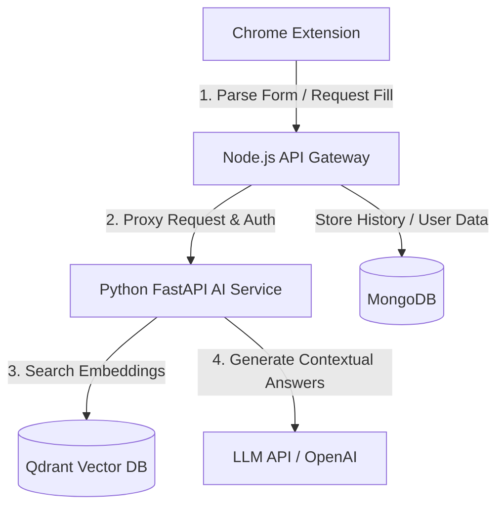

# Job Autofill Assistant

An AI-powered Chrome extension and self-hosted RAG (Retrieval-Augmented Generation) backend ecosystem that automatically analyzes job application forms, retrieves contextually relevant information from your resume, and autofills fields with precision.

## Architecture Overview



### Components

1. **Extension (`/extension`)**: A Manifest V3 Chrome Extension.
   - Detects forms, traverses DOM structures.
   - Matches form fields to semantic labels.
   - Safe DOM injection to auto-fill text inputs, dropdowns, checkboxes, and radio buttons.
   
2. **Backend Gateway (`/backend`)**: A Node.js & Express gateway API.
   - User authentication and session management.
   - Resume file uploads (PDF/Docx text parsing proxy).
   - Rate limiting, schema validation, and database storage for job applications.
   
3. **AI Service (`/ai-service`)**: A FastAPI RAG service.
   - Document chunking strategies for parsing resumes.
   - Vector database storage & semantic search using Qdrant.
   - Query generation & LLM prompting (OpenAI/Gemini/Anthropic).
   - (Phase 2) Cohere reranking for ultra-precise context retrieval.

---

## Getting Started

### Local Development with Docker

To run the entire self-hosted stack (MongoDB, Qdrant, Node.js Backend, and FastAPI AI Service) locally:

1. Clone this repository.
2. Configure your environment variables in `./backend/.env` and `./ai-service/.env` (see templates).
3. Run the services via Docker Compose:
   ```bash
   docker-compose up --build
   ```

### Loading the Chrome Extension

1. Open Google Chrome and navigate to `chrome://extensions/`.
2. Enable **Developer mode** (toggle in the top-right corner).
3. Click **Load unpacked** in the top-left corner.
4. Select the `extension/` directory of this repository.

---

## Project Structure

```
job-autofill-assistant/
│
├── extension/                          # Chrome Extension (Manifest V3)
│   ├── manifest.json
│   ├── background/
│   │   └── service-worker.js           # Persistent background logic
│   ├── content/
│   │   ├── form-detector.js            # DOM traversal + field extraction
│   │   ├── autofill-injector.js        # Safe DOM injection
│   │   └── semantic-extractor.js       # Label/context understanding
│   ├── popup/
│   │   ├── popup.html
│   │   ├── popup.js
│   │   └── popup.css
│   └── utils/
│       └── message-bus.js              # Typed message passing
│
├── backend/                            # Node.js API Gateway
│   ├── src/
│   │   ├── app.js                      # Express entry point
│   │   ├── routes/
│   │   │   ├── auth.routes.js
│   │   │   ├── resume.routes.js
│   │   │   └── application.routes.js
│   │   ├── controllers/
│   │   ├── middlewares/
│   │   │   ├── auth.middleware.js
│   │   │   └── ratelimit.middleware.js
│   │   ├── models/                     # Mongoose schemas
│   │   │   ├── User.model.js
│   │   │   ├── Resume.model.js
│   │   │   └── Application.model.js
│   │   ├── services/
│   │   │   ├── file.service.js         # Upload handling
│   │   │   └── ai-proxy.service.js     # Calls Python FastAPI
│   │   └── config/
│   │       └── db.js
│   ├── Dockerfile
│   └── package.json
│
├── ai-service/                         # Python FastAPI RAG Service
│   ├── main.py
│   ├── api/
│   │   ├── routes/
│   │   │   ├── embed.py
│   │   │   ├── retrieve.py
│   │   │   └── generate.py
│   ├── core/
│   │   ├── chunker.py                  # Document chunking strategies
│   │   ├── embedder.py                 # OpenAI embedding calls
│   │   ├── retriever.py                # Qdrant vector search
│   │   ├── reranker.py                 # Cohere reranking
│   │   └── generator.py               # LLM answer generation + prompt mgmt
│   ├── db/
│   │   └── qdrant_client.py
│   ├── schemas/
│   │   └── models.py                   # Pydantic models
│   ├── Dockerfile
│   └── requirements.txt
│
├── docker-compose.yml
└── README.md
```
